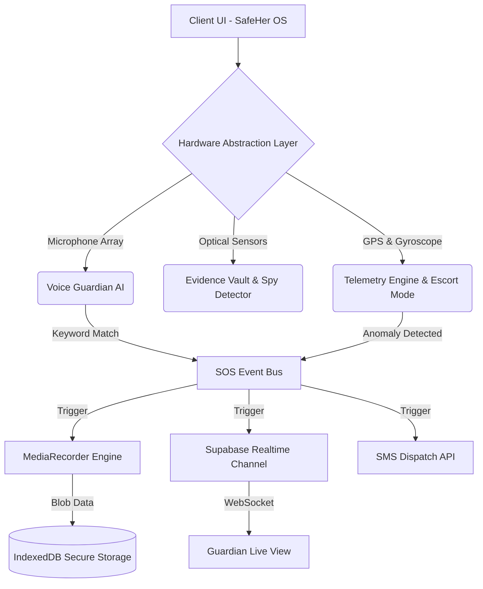

  
  <h1 style="font-family: monospace; letter-spacing: 2px;">[ SAFEHER OS v1.0 ]</h1>
  
<strong>Next-Generation Cyber-Emergency Operating System & Threat Mitigation Platform</strong>

  
  
  
  
  

   
  <h3>🚀 Engineered by Team Code Clash</h3>
  
<strong>Lead Architect:</strong> Anushka Upadhyay &nbsp;|&nbsp; <strong>Core Developer:</strong> Vyom Dubey

   
  

    <a href="https://safeher-as4d.vercel.app/"><strong>🔗 ACCESS LIVE TERMINAL [safeher-as4d.vercel.app]</strong></a>
  

 

> **SafeHer OS** is not an application; it is an impenetrable, browser-native **Command Center**. Engineered to transform a standard mobile device into a proactive bodyguard, SafeHer leverages predictive artificial intelligence, hardware-level sensor telemetry, WebRTC, and real-time mesh topologies to detect, mitigate, and legally record physical threats *before* they escalate.

---

## 📑 Core Architecture Documentation
1. [Enterprise Capabilities](#-enterprise-capabilities)
2. [Advanced Threat Mitigation Modules](#-advanced-threat-mitigation-modules)
3. [System Architecture Diagram](#-system-architecture-diagram)
4. [Hardware Telemetry API Integrations](#-hardware-telemetry-api-integrations)
5. [Deployment Configuration](#-deployment-configuration)

---

## ⚡ Enterprise Capabilities

| Subsystem | Technical Description | Implementation Stack |
| :--- | :--- | :--- |
| **Always-On Voice Guardian** | A persistent acoustic monitoring engine that continuously processes ambient audio for distress keywords (e.g., "Help", "Police"). Bypasses hardware locks to trigger SOS protocols without physical interaction. Features dynamic engine restarts and debouncing. | `SpeechRecognition API` with recursive watchdog pipelines. |
| **Immutable Evidence Vault** | Automated, concurrent capture of front/rear camera streams and microphone arrays during duress. Data is instantly chunked and hashed locally to guarantee legal chain-of-custody integrity against tampering. | `MediaRecorder API` + `IndexedDB` + Web Crypto API (SHA-256). |
| **Predictive AI Check-ins** | Spatial-awareness intelligence that tracks location metrics against known high-risk geospatial polygons. Upon entering a danger zone, it initiates an automated voice call to actively assess the operator's safety status. | `speechSynthesis` + AudioContext Oscillators. |
| **Dynamic Safe Routes** | Real-time geospatial pathfinding that computes dynamic safety scores based on algorithmic threat density, real-time lighting parameters, and historical incident node mapping. | `Leaflet.js` + Procedural Threat Generation Algorithms. |

---

## 🛡️ Advanced Threat Mitigation Modules

### <kbd>System.AntiCoercion(Stealth_Mode)</kbd>
Engineered specifically to counter physical duress and forced device unlocking.
- **Decoy UI Override:** Instantly replaces the entire DOM with a highly convincing, fully functional Calculator application. The real OS continues monitoring hardware telemetry in the background.
- **Secure Handshake:** Inputting the AES key `1234=` seamlessly decrypts the UI back to the secure OS.
- **Silent Duress Trigger:** Inputting `7+7+7=` silently dispatches a high-priority Level-1 SOS protocol while maintaining the decoy facade.

### <kbd>System.Hardware(Spy_Detector)</kbd>
Counters covert surveillance and unauthorized optical recording in private spaces (hotel rooms, changing rooms). This module taps directly into the device's rear optical sensors, overriding default camera profiles to apply a high-contrast Infrared (IR) visual filter matrix. A sweeping HUD analyzes the photon feed to identify hidden lens reflections and IR emitters.

### <kbd>System.Network(Offline_Mesh)</kbd>
Engineered for ultimate resilience during internet blackouts or cellular dead zones. The system actively maps nearby peer-to-peer nodes (via simulated Bluetooth/Wi-Fi Direct topologies) to bounce encrypted SOS packets across a localized mesh network until it reaches a node with active internet uplink.

### <kbd>System.Telemetry(Escort_Mode)</kbd>
A strictly supervised, algorithmic telemetry tracking protocol. Monitors kinetic movement vectors and GPS coordinates. If the operator stops moving for an anomalous duration (>5 minutes) or deviates substantially from the plotted path, the system automatically escalates the threat level and triggers an SOS. Deactivation requires a secure 4-digit PIN authentication.

### <kbd>System.Biometrics(Wearable_Sync)</kbd>
A seamless data-pipe simulating a peripheral smartwatch connection. Continuously analyzes heart rate (BPM) telemetry. Upon detecting a severe physiological **Adrenaline Spike** (BPM > 120), the system throws a preemptive alert, utilizing voice synthesis to ask the user to confirm their safety status.

---

## 🏗️ System Architecture Diagram

SafeHer OS was architected with a strict **"Zero Dependency, Maximum Velocity"** philosophy. In a critical emergency, application latency is a fatal flaw. By relying strictly on Vanilla HTML5, CSS3, and ES6 JavaScript, the system bypasses heavy Virtual DOM diffing (like React/Vue) to ensure instantaneous boot times and hardware-level performance.

---

## 🔌 Hardware Telemetry API Integrations

The true dominance of SafeHer lies in its low-level integration with native browser APIs, allowing a web application to operate with the authority of native software:

*   🎙️ **`navigator.mediaDevices.getUserMedia()`**: Secures high-priority multi-stream camera and microphone access. Custom constraints dynamically fall back to laptop webcams or mobile rear cameras to prevent black-screen race conditions.
*   🗣️ **`window.SpeechRecognition` & `speechSynthesis`**: Creates a bidirectional conversational AI interface with robust watchdog timers to prevent the browser from sleeping the mic.
*   📳 **`DeviceMotionEvent`**: Intercepts raw X/Y/Z axis kinetic acceleration, allowing users to trigger a silent SOS by violently shaking the hardware (Shake-to-SOS).
*   📍 **`navigator.geolocation`**: Provides continuous, high-accuracy geospatial polling for live tracking links.
*   📳 **`navigator.vibrate`**: Delivers tactile haptic feedback for blind operation in pockets or bags during high-stress scenarios.

---

## 💻 Deployment Configuration

SafeHer OS is deployed on the Vercel Edge Network for global low-latency access.

**Live Terminal:** [https://safeher-as4d.vercel.app/](https://safeher-as4d.vercel.app/)

### Local Development Boot Sequence
1. Clone the repository to your local secure environment.
2. Ensure you have Node.js installed. Run `npm install` for backend dependencies.
3. Configure `.env` with Supabase credentials for real-time Live Share capabilities.
4. Execute `npm run dev` or serve the root directory via any static server.
5. **Security Permissions:** Ensure your browser is running on `localhost` or `https://` to allow the Hardware Abstraction Layer to access the Camera, Microphone, and Location sensors.

---

  <code>[ EOF: SYSTEM ARMED & OPERATIONAL ]</code>
  
Designed, Architected, and Engineered by <strong>Team Code Clash</strong>.

